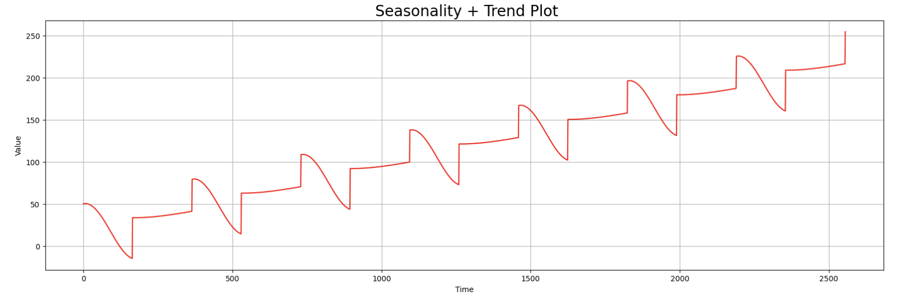
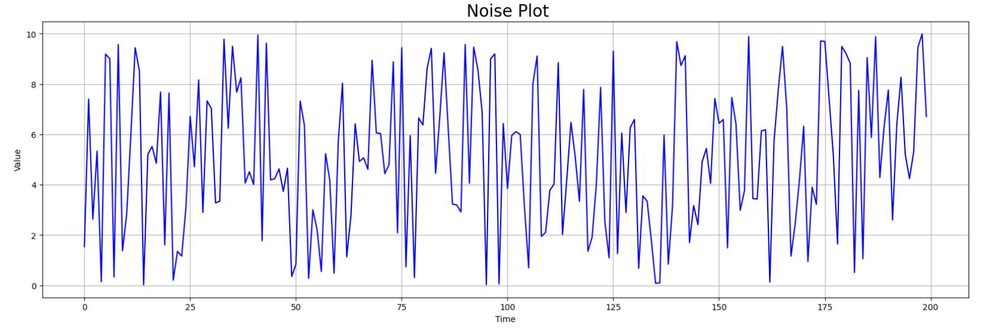
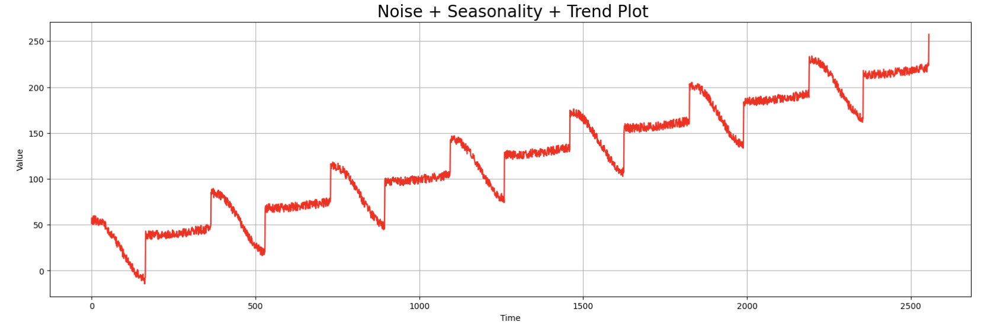
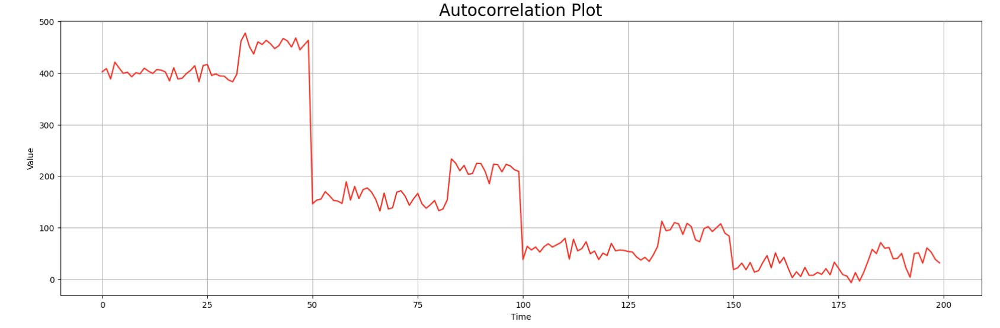
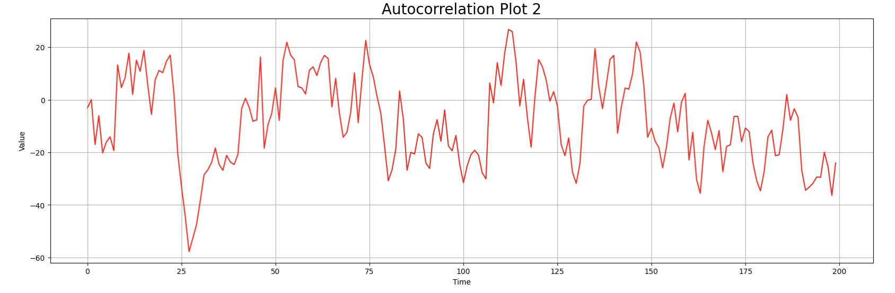
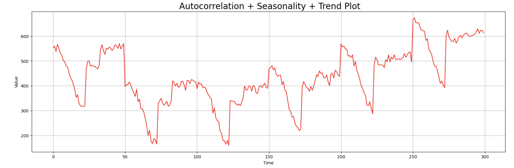
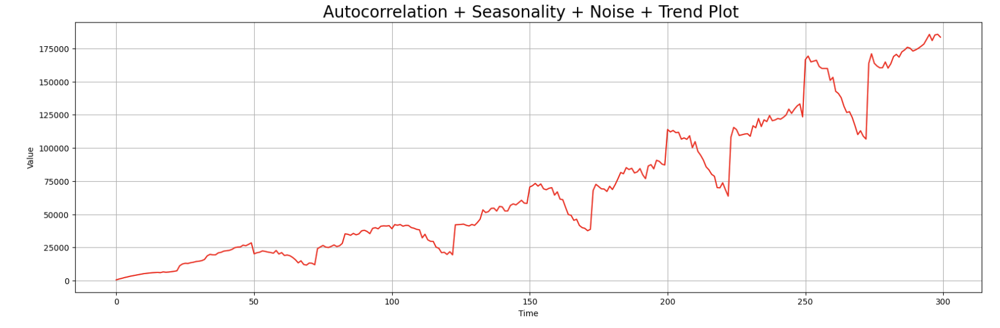
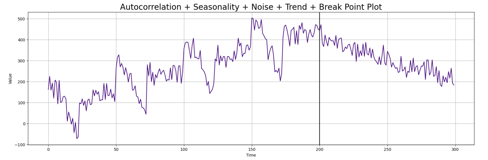

# time_series_visualisation
This is an insight into time series plots and different methods of visualisation. 

We will cover 5 different plots: 

1. Trend
2. Seasonality
3. Noise
4. Autocorrelation
5. Break Point

# Trend

Quite simply plots the general trend of the time-series plot within the time frame you assign

# Seasonality

Seasonality is a characteristic of time series plots where the data experiences regular and periodic changes that recur every calendar year. Any predictable fluctuation or pattern that recurs over a one-year period is said to be seasonal. For a business or company, understanding the seasonality of their business can help them predict and time inventories, staffing, and other decisions to coincide with the expected seasonality of the associated activities, therefore reducing costs and increasing revenue. 

In the context of stock market analysis, seasonality can play a crucial role in potential profits and portfolios. A business may experience significantly higher sales during peak season and significant losses during off-season. Not taking this into consideration could lead to buying or selling at the wrong time. 

# Noise

(White) Noise holds three main characteristics

1. Constant Mean

2. Constant Variance

3. No autocorrelation

These characteristics mean the time series plot will have no pattern and using the plot to make predictions will be imposiible. This property of time series is used to optimise predictive models and is usually a sign of a poor model. 

# Autocorrelation

Autocorrelation is a representation of the degree of similarity between a given time series and a lagged version of itself over successive time intervals. It essentially measures the relationship between a variables current value and its past values. 

Technical analysts will use autocorrelation to measure how much influence past prices for a security have on its future price. 

# Break Point 

A breakpoint is a structural change in data, such as an anomaly or an unexpected event. In time series plots this is uually a change in mean or change in the other parameters of the process that produce the series. 

