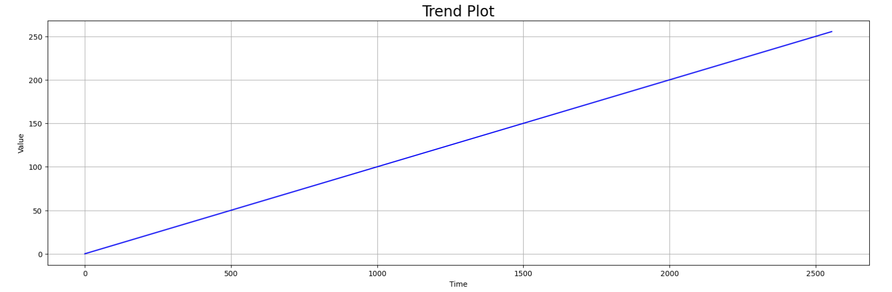

# time_series_visualisation
This is an insight into time series plots and different methods of visualisation. 

We will cover 5 different plots: 

1. Trend
2. Seasonality
3. Noise
4. Autocorrelation
5. Break Point

# Trend

Quite simply plots the general trend of the time-series plot within the time frame you assign

